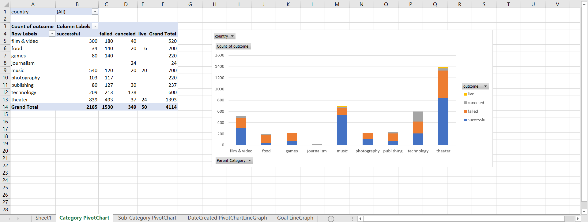

# Excel Kickstarter Analysis

In this project, Excel was used to organize and analyze a dataset about Kickstarter campaigns.

### Kickstarter Campaign Data

### Kickstarter Data Visualizations

### Interpretations 

The data shows that Kickstarter campaigns from the music category have the most successfully funded goals (77% successful, 17% failed) while Kickstarter campaigns 
from the theater category have the most unsuccessfully funded goals (35% failed, 60% successful).  Music projects appear to perform the best in acquiring funding 
through Kickstarter.  In addition, Kickstarter campaigns created in December have the most unsuccessfully funded goals (44% successful), and Kickstarter campaigns 
created in May have the most successfully funded goals (61% successful).  Thus, according to the data, the best time to start a Kickstarter campaign is in May, and 
the worst time to start a Kickstarter campaign is in December.  The data also suggests that Kickstarter campaigns with low funding goals tend to have more 
successfully funded goals than Kickstarter campaigns with high funding goals.

### Dataset Limitations

This dataset mainly has data from Kickstarter campaigns created in the United States (74%).  Because of this, the dataset is not representative of the world 
population.  In addition, although the creation dates for Kickstarter campaigns range from 2009 to 2017, most of the Kickstarter campaigns in this dataset were 
created in 2015 (30%) and 2016 (23%).  Because of this, the dataset is not representative of the entire history of Kickstarter.

### Additional Potential Tables/Graphs for Data Visualization

Stacked column pivot graphs can be created to compare spotlight and staff pick with the count of Kickstarter campaign states. These graphs may reveal trends 
between spotlight or staff pick and the success rate of Kickstarter campaigns.  Another way to visualize the data is to create a table that contains the Kickstarter campaign duration using 
the difference between date created and date ended.  The table can include the percentage of successful, failed, and canceled Kickstarter campaigns in order to 
create a line graph that compares Kickstarter campaign duration with percentage of successful, failed, and canceled Kickstarter campaigns.